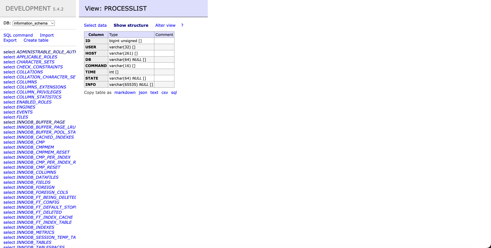

# Copy Structure Export

An Adminer plugin that adds a compact toolbar to the table structure view and lets you copy the structure in multiple formats.

## Features

- Copy table structure as Markdown
- Copy table structure as JSON
- Copy table structure as plain text
- Copy table structure as CSV
- Copy table structure as SQL
- Works directly from the Adminer structure screen
- Includes a clipboard fallback for browsers without the modern Clipboard API

## Screenshots

Replace these placeholders with your base64-embedded images.

### Structure view


### Markdown output
| Column | Type | Comment |
| --- | --- | --- |
| ID | bigint unsigned [] |  |
| USER | varchar(32) [] |  |
| HOST | varchar(261) [] |  |
| DB | varchar(64) NULL [] |  |
| COMMAND | varchar(16) [] |  |
| TIME | int [] |  |
| STATE | varchar(64) NULL [] |  |
| INFO | varchar(65535) NULL [] |  |

## Requirements

- Adminer with plugin support enabled
- A browser with JavaScript enabled
- Clipboard access for best results

## Installation

### Option 1: adminer-plugins/ directory

1. Copy copy-structure-export.php into your Adminer plugins directory.
2. Make sure the file is loaded by Adminer on startup.
3. Reload Adminer and open a table structure page.

Example layout:
```text
adminer-plugins/  
  copy-structure-export.php
```

### Option 2: adminer-plugins.php

If you use a plugin bootstrap file, return the plugin instance from adminer-plugins.php:

```php
<?php

return array(  
    new Adminer\CopyStructureExport(),  
);
```

Place adminer-plugins.php next to Adminer’s entry point so it is picked up during bootstrap.

## Usage

1. Open a table in Adminer.
2. Go to the structure view.
3. Use the **Copy table as** toolbar.
4. Click the format you want.
5. Paste the copied output wherever you need it.

## Supported formats

- Markdown
- JSON
- Text
- CSV
- SQL

## Notes

- The plugin copies the structure table currently shown in Adminer.
- Markdown output is formatted for readable docs and notes.
- SQL output uses the table name from the current URL.
- The clipboard fallback uses a temporary hidden textarea when navigator.clipboard is unavailable.

## Files

- plugins/copy-structure-export.php - the Adminer plugin implementation

## License

Dual licensed under:

- Apache License 2.0
- GNU General Public License v2
